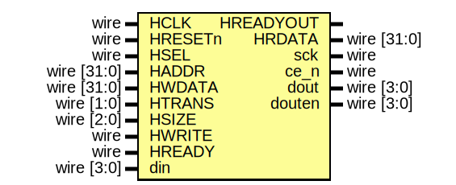

# ms_psram_ctrl

A Quad I/O SPI Pseudo Static RAM (PSRAM) Controller.
PSRAM is a DRAM combined with a self-refresh circuit. It appears externally as slower SRAM, albeit with a density/cost advantage over true SRAM, and without the access complexity of DRAM. PSRAM chips have many advantages that makes them very good for IoT applications.
- Low Power Consumption
- Low pin count and small packages
- High-Speed Access
- Low Cost

The controller was designed after [this part](https://www.issi.com/WW/pdf/66-67WVS4M8ALL-BLL.pdf) from ISSI. It utilizes both quad I/O EBh and 38h commands only for reading and writing.

The controller comes with two versions for both AHB and Wishbone (classical) buses.

The controller is very small in size. It is synthesized to around 500 cells.

## Interface

## Performance
The controller supports quad I/O SPI interface. However better than the classical serial SPI, reading and writing require several cycles depending the amount of data being read or written. Moreover, data reads are slower than data writes. Hence using PSRAM as the data memory in embedded applications slows down the system. Typically, a smaller (mor expensive) internal SRAM is used for frequent data objects and the large slow PSRAM is used for less frequent data objects. 

The following table shows how the execution times of some common kernels are impacted by using only external PSRAM vs. using only internal SRAM. The collected data were obtained using Cortex-M0 based system.

| kernel | PSRAM Execution Time (usec) | Internal SRAM Execution Time (usec) | Ratio |
| ------ | -------------------------- | --------------------------- | --------- | 
| xtea | 840 | 446 | 3.94 | 
| stress   | 1607 | 446  | 3.6|
| hash     | 5340 | 1281 | 4.1|
| chacha   | 2814 | 320  | 8.8|
| aes sbox | 2370 | 322  | 7.3|
| nqueens  | 3496 | 459  | 7.6|
| mtrans   | 2171 | 2034 | 1.0|
| rle      | 903  | 155  | 5.8|
| prime    | 549  | 97   | 5.6|

